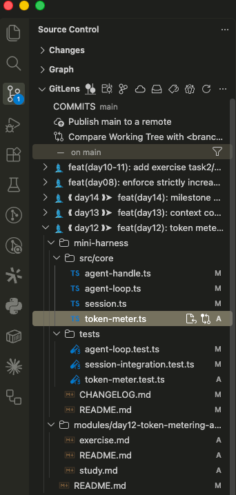

# 企业级 Agent / Agent Harness：白话教材 + 可运行代码

> 基于 DeepSeek Harness（DSH，`deepseek-ai/deepseek-harness`）架构与文档的实践课程。
> 目标不是复刻 DSH，而是通过一个持续演进的 `MiniHarness`，用大白话讲清楚每一层设计在解决什么真实问题，再动手把它实现一遍。

## 这本书是什么、怎么用

这不是一份"每天扔几个外链"的学习计划——那是它的上一版，读起来太吃力。现在的结构是：

```
agent-study/
├── README.md              # 你正在读的这份：总览 + 使用说明 + 路线图
├── modules/                # 白话教材本体，一天一个目录
│   └── dayNN-主题/
│       ├── README.md      # 本日目录：学习目标、怎么学、验收标准
│       ├── study.md       # 白话讲解正文（类比 + 原文引用 + 踩坑记录，不是文档翻译）
│       └── exercise.md    # 实践任务
└── mini-harness/           # 贯穿全程、持续演进的同一个 TypeScript 工程
    ├── src/                # 逐天增量搭建的代码
    ├── tests/               # 每天的测试，pnpm test 随时可跑
    └── CHANGELOG.md         # 逐天记录新增/修改了什么、修了什么 bug
```

**推荐阅读顺序**：先扫一眼 [modules/day00-phase1-overview/](modules/day00-phase1-overview/)（阶段一全貌地图，不含练习，现在看不懂大部分术语是正常的），再打开 `modules/day01-.../README.md` 跟着往下走。每天：先读 `study.md` 建立心智模型 → 看 `mini-harness/` 里对应的代码 → 做 `exercise.md` 的练习 → 跑 `pnpm test` 验证。学到中途觉得"看细节看到出不来"的时候，随时回 Day0 那张地图对一遍——这正是它存在的目的。

**代码怎么对照**：`mini-harness/` 是一个 git 仓库（本目录本身就是），每天结束都打了一个 tag（`day01`…`day21`）。卡住了可以 `git diff day0X..day0Y` 看某一天具体改了什么，或者 `git log --oneline` 看整体演进脉络。**建议先自己写，卡住 30-40 分钟再对照参考实现**，不要一上来就抄。

## 学习建议

**装个 [GitLens](https://marketplace.visualstudio.com/items?itemName=eamodio.gitlens)（VS Code 插件）**，比纯敲 `git diff`/`git log` 命令行更快找到"这一天到底改了哪些文件"。它在侧边栏的 Source Control 面板里会把提交历史列成一棵可展开的树，点开某一天的提交（比如 `feat(day12): token metering...`），下面直接铺开这次提交动过的每一个文件——代码、测试、`CHANGELOG.md`、`modules/dayNN-.../` 下的文档全部一目了然，不用切到终端敲命令再肉眼比对：



日常用法：想知道"Day12 到底改了哪些代码"，直接在这棵树里找到 `feat(day12): ...` 那次提交点开就行，比 `git diff day11..day12` 更直观——尤其是想同时看清"这一天动了几个 `src/` 文件、几个测试、文档改没改"这种概览时，树状展开比一大坨 diff 文本更快扫一眼看懂。

## 目前进度：阶段一、阶段二、阶段三已完成，阶段四进行中（Day1-24）

| 天 | 主题 | 目录 |
|---|---|---|
| 0 | 阶段一全貌地图（不含练习，学完 Day1-7 回来对照用） | [modules/day00-phase1-overview/](modules/day00-phase1-overview/) |
| 1 | Agent / Workflow / Harness 的边界，设计两次 | [modules/day01-agent-vs-workflow/](modules/day01-agent-vs-workflow/) |
| 2 | LLM 消息模型与流式协议 | [modules/day02-llm-message-and-streaming/](modules/day02-llm-message-and-streaming/) |
| 3 | Adapter 边界与请求信封 | [modules/day03-adapter-boundary/](modules/day03-adapter-boundary/) |
| 4 | 工具定义——接口质量决定 Agent 上限 | [modules/day04-tool-design/](modules/day04-tool-design/) |
| 5 | 实现 Agent Loop | [modules/day05-agent-loop/](modules/day05-agent-loop/) |
| 6 | 生命周期、取消与并发 | [modules/day06-lifecycle-and-cancellation/](modules/day06-lifecycle-and-cancellation/) |
| 7 | 里程碑一：可测试的单 Agent CLI | [modules/day07-milestone-cli/](modules/day07-milestone-cli/) |
| 8 | 仅追加事件日志与真源 | [modules/day08-session-event-log/](modules/day08-session-event-log/) |
| 9 | 持久化、flush 与崩溃恢复 | [modules/day09-persistence-and-crash-recovery/](modules/day09-persistence-and-crash-recovery/) |
| 10 | 投影、查询、标题与 Spill | [modules/day10-projection-query-spill/](modules/day10-projection-query-spill/) |
| 11 | 系统提示词与能力组装 | [modules/day11-system-prompt-and-capabilities/](modules/day11-system-prompt-and-capabilities/) |
| 12 | Token 计量、预算与成本控制 | [modules/day12-token-metering-and-budget/](modules/day12-token-metering-and-budget/) |
| 13 | 上下文窗口与压缩 | [modules/day13-context-compaction/](modules/day13-context-compaction/) |
| 14 | 里程碑二：可恢复的长会话 | [modules/day14-milestone-two/](modules/day14-milestone-two/) |
| — | 阶段二全貌地图（Day8-14，学完回来对照用） | [modules/day08-13-phase2-overview/](modules/day08-13-phase2-overview/) |
| 15 | 文件系统能力与一致性 | [modules/day15-filesystem-consistency/](modules/day15-filesystem-consistency/) |
| 16 | 子进程与 Bash 执行 | [modules/day16-subprocess-and-bash/](modules/day16-subprocess-and-bash/) |
| 17 | PTY、后台任务与资源所有权 | [modules/day17-jobs-and-resource-ownership/](modules/day17-jobs-and-resource-ownership/) |
| 18 | 沙箱与最小权限 | [modules/day18-sandbox-and-least-privilege/](modules/day18-sandbox-and-least-privilege/) |
| 19 | 审批、权限预设与用户问答 | [modules/day19-approval-and-permissions/](modules/day19-approval-and-permissions/) |
| 20 | 凭据、设置、存储与工作区 | [modules/day20-credentials-settings-workspace/](modules/day20-credentials-settings-workspace/) |
| 21 | 里程碑三：安全执行型 Agent | [modules/day21-milestone-secure-agent/](modules/day21-milestone-secure-agent/) |
| — | 阶段三全貌地图（Day15-21，学完回来对照用） | [modules/day15-21-phase3-overview/](modules/day15-21-phase3-overview/) |
| 22 | HTTP Server、API Gateway 与流式协议 | [modules/day22-http-server-and-streaming/](modules/day22-http-server-and-streaming/) |
| 23 | Client model、Conversation 与重连语义 | [modules/day23-client-and-reconnection/](modules/day23-client-and-reconnection/) |
| 24 | 技能、命令、计划、目标与提醒 | [modules/day24-skills-commands-plan-goal-reminder/](modules/day24-skills-commands-plan-goal-reminder/) |

跑完 Day1-24，`mini-harness/` 会有一个能跑的调查 CLI（`pnpm cli -- --workspace <目录> --query <关键词> --session-file <路径>`，支持崩溃后从同一份文件恢复）、一条端到端的安全写入链路（`pnpm cli -- propose-edit --workspace <目录> --file <路径> --find <文本> --replace <文本>`：读文件 → 生成新内容 → 展示 diff → 人工审批或权限预设 → 批准才写盘 → 可选跑验证命令）、一个能被真实网络访问的 HTTP 服务器（`createHttpServer()`：create/send/cancel/inspect/events stream，换行分隔 JSON 流协议区分 baseline/increment/terminal/transport-error，幂等 key 防重复提交，慢客户端有硬性积压字节上限）、一个断线自动重连、最终收敛到服务端权威状态的终端客户端（`Conversation` 去重/补洞 + `ReconnectingStream` 自动重连），以及独立于 CLI 之外、工具层已经具备的写文件能力（`edit_file`，带 symlink 逃逸防护和乐观并发控制）、子进程执行能力（`run_command`，argv 数组不经过 shell、env 白名单、超时/取消杀整棵进程树）、后台任务能力（`start_job`/`job_status`/`cancel_job`，跨多次调用追踪一个还在跑的子进程，幂等释放）、命令策略（`CommandPolicy`，白名单+fail-closed）、审批机制（`ApprovalStore`，一次性、绑定具体参数，防重放/防换参数/防过期）和凭据/设置能力（`CredentialRef`/`CredentialStore` 只以不透明引用流动、`mergeSettings` 分层合并带来源、`WorkspaceContext` 让 `run_command` 能安全注入凭据而不经过模型）。现在共 463 条测试，覆盖流式组装、请求重试、工具执行管线、Agent loop 终态、取消/释放的竞态、多轮会话记忆、事件日志的开闭配对不变式、持久化崩溃恢复、投影/查询/标题派生、系统提示词组装、Token 计量与预算、上下文压缩、文件系统路径逃逸与并发写冲突、子进程故障注入（输出洪水/永不退出/fork 子进程/env 泄漏/取消竞态）、后台任务生命周期与幂等释放、跨天红队回归（prompt injection/shell 绕过/symlink 逃逸/网络外传/fork bomb）、凭据引用不泄漏真实值与工作区凭据优先级、审批+写入+验证端到端链路（含"审批消费和落盘之间的竞态"这个诚实记录的缺口）、HTTP 服务器端到端流程（真实临时端口+真实 socket，覆盖幂等去重/取消传播/鉴权/慢客户端 backlog 超限）、客户端断线重连（8 个种子的故障注入,最终收敛到权威 session 状态,含一个"收到 terminal 不等于真的同步完了"的真实设计缺陷从发现到修复）、Goal 状态机的四种状态组合、Skill 按需加载接入系统提示词的集成测试。除了 CLI 和服务器,今天还有按需加载技能 `SkillRegistry`（接入 Day11 `buildSystemPrompt`）、人触发命令 `Command`/`CommandRegistry`（示范包装 Day21 `proposeEdit`）、`PlanModeController`（复用 Day19 `PermissionPreset`）、目标状态机 `GoalStore`（模型自称完成不能直接关闭目标,必须过外部 `verify()`）、定时提醒 `scheduleReminder`（Day6 `Agent.steer()` 套一层定时器,~20行）。过程中真实踩到并修复了好几个 bug（数组被意外冻结、`AbortSignal` 被深冻结坏掉、取消检查时机错误、Session 收尾事件漏转发进持久化 store、重复压缩产生互相重叠的区间、崩溃截断后续写把日志粘成乱码、重连信号判断不完整……），这些坑本身就是很好的教材，都记录在对应天数的 `study.md` 里，不是我编的案例。`modules/day21-milestone-secure-agent/security-test-index.md` 是一份汇总 Day15-21 安全属性的 25 条测试索引，`incident-drill.md` 是一次假设的安全事件演练。

阶段一、二、三都已完成，阶段四（Day22-27，平台化与编排）进行中，讲解风格验证下来没问题。**下面是尚未做成白话教材的后续阶段（Day23-30）大纲，作为路线图参考**，如果你想提前预习，仍然可以按原始大纲里的官方文档链接去读——但建议先等对应模块出来。

## 学习假设与时间投入

- 建议每天 3～4 小时：读 `study.md` + 看代码 45～60 分钟，做练习 90～120 分钟，测试与复盘 45～60 分钟。
- 默认采用 TypeScript + Node.js（`mini-harness/` 用 pnpm + vitest），因为 DSH 本身是 TypeScript monorepo，便于对照源码。
- 需要掌握：TypeScript 基础、Promise/async、JSON Schema、基本测试知识。
- 模型供应商不限。课程只依赖自建的 `LlmAdapter` 接口（Day3），演示用的 `HeuristicInvestigationAdapter` 不连真实模型；接入真实模型是照着接口自己写一个实现即可。

## MiniHarness 项目理念

有两个容易想到但都不理想的方案：只做一个业务 Demo（上手快，但看不到恢复、安全、可观测性问题），或者直接复刻 DSH（覆盖全面，但会被插件系统和平台细节淹没）。本课程采用第三种方案：构建一个"小而完整"的 Harness——只支持一个本地工作区和一种主 Agent，但保留生产系统最关键的边界与不变式；子 Agent、Web Client、插件化在后期按需加入，不提前搭。

不要在第一天创建全部空目录。只在某项能力出现时建立对应模块，避免分类学式的空壳架构——这也是为什么 `mini-harness/src/` 目前只有 `llm/`、`tools/`、`core/` 三个目录，其余（`session/`、`context/`、`policy/`、`orchestration/`、`platform/`、`telemetry/`）要等到对应阶段才会出现。

---

## 阶段 III～V：尚未做成白话教材的路线图（Day 15～30）

以下内容保留自初版大纲，仍然是后续阶段的计划，但还没有经过"研究提炼 + 白话讲解 + 代码化"处理。读起来会比 Day1-24 的 `modules/` 吃力，仅供预习/参考。阶段 II（Day8-14）的原始大纲仍然保留在下面作为对照，但已经全部落地，实际内容请看 `modules/day08-*` 到 `modules/day14-*`，不要以下面这份原始大纲为准。

### 30 天总览

| 阶段 | 天数 | 主线 | 阶段产物 |
|---|---:|---|---|
| I. 最小但正确的内核 ✅ | 1～7 | Agent loop、流式模型、工具、生命周期 | 可测试的单 Agent CLI（已完成，见 `modules/`） |
| II. 可回放的状态与上下文 ✅ | 8～14 | 事件溯源、持久化、投影、Token、压缩 | 可崩溃恢复的会话系统（已完成，见 `modules/`） |
| III. 受控执行与人机协作 ✅ | 15～21 | 文件/进程/后台任务、审批、沙箱、凭据 | 安全的执行型 Agent（已完成，见 `modules/`） |
| IV. 平台化与编排（进行中，Day22-24 已完成） | 22～27 | API、Client、skills、goal、subagent、workflow | 可远程使用的 MiniHarness |
| V. 生产验证与毕业设计 | 28～30 | 遥测、评测、压力、混沌、安全与架构评审 | 企业级设计包与演示 |

### 阶段 II：可回放的状态与上下文（Day 8～14）——**已完成，实际实现见 `modules/day08-*` 到 `modules/day14-*`**

以下是初版大纲的原始描述，保留作参考对照；实际怎么落地的、踩了哪些坑，请看对应天数的 `study.md`，不要以下面这份为准。

#### Day 8：仅追加事件日志与真源

**学习目标**：理解 DSH 将 Session 设计为类型化、仅追加日志，模型历史从日志派生而非另存一份；区分持久事实与瞬态控制状态。

**阅读**：[会话](https://deepseek-harness.github.io/deepseek-harness/reference/subsystems/session) · [持久化事件目录](https://deepseek-harness.github.io/deepseek-harness/reference/persistence-catalog)

**实践**：定义 `turn/start|end`、`step/start|end`、`user/message`、`assistant/chunk|message`、`tool/call|result`；每条事件具有连续 seq、time、version，payload 必须是无损 JSON；实现 `deriveMessages(events)`，禁止单独维护一份可漂移的 message history。

**不变式**：同一 turn/step 的开闭必须配对；tool result 必须对应先前 callId；已记录为模型可见的输入必须能从日志重建；replay 两次得到相同派生结果。

#### Day 9：持久化、flush 与崩溃恢复

**阅读**：[会话持久化](https://deepseek-harness.github.io/deepseek-harness/reference/subsystems/persistence) · [运行时不变式](https://deepseek-harness.github.io/deepseek-harness/reference/subsystems/invariants)

**实践**：先实现 JSONL `SessionPersistence`（create、append、load、flush、list）；事件追加与业务循环解耦，关键边界执行 flush checkpoint；未闭合 turn 恢复时保留已写事件并追加 `interrupted` 终止事实；引入 session header（格式版本、创建时间、cwd、parent、agent preset）。

**故障注入**：在写入每一类事件后强杀进程；注入半行 JSON、重复 seq、磁盘写失败和未来版本。

**验收**：重启后能区分 interrupted、corrupted、unsupported_version；flush 失败不得记录成成功；恢复过程不得改写已持久化历史。

#### Day 10：投影、查询、引用、标题与 Spill

**阅读**：[会话投影](https://deepseek-harness.github.io/deepseek-harness/reference/subsystems/session-projection) · [会话查询](https://deepseek-harness.github.io/deepseek-harness/reference/subsystems/session-query) · [会话引用](https://deepseek-harness.github.io/deepseek-harness/reference/subsystems/session-reference) · [会话标题](https://deepseek-harness.github.io/deepseek-harness/reference/subsystems/session-title) · [Spill 存储](https://deepseek-harness.github.io/deepseek-harness/reference/subsystems/spill)

**实践**：写纯函数 projection（turn 边界、token 总量、工具统计、当前 goal）；按 seq 精确分页，不用数组 index 冒充稳定游标；为大工具结果建立 `SpillRef`；标题生成记录来源消息 seq，跨会话引用用结构化 id。

**验收**：全量 replay 与增量 projection 结果逐字段一致；Spill 丢失返回稳定错误。

#### Day 11：系统提示词与能力组装

**阅读**：[系统提示词](https://deepseek-harness.github.io/deepseek-harness/reference/subsystems/system-prompt) · [能力服务](https://deepseek-harness.github.io/deepseek-harness/reference/capability-services) · [作用域](https://deepseek-harness.github.io/deepseek-harness/reference/subsystems/scope)

**实践**：prompt 分成稳定段（身份、工作区、政策、能力说明、任务上下文）；工具 schema 与 prompt 每次请求前由同一能力快照组装；记录渲染后的请求信封；设计 global/workspace/session/agent 四级作用域，先实现 session 与 agent 两级。

**验收**：工具被移除后 prompt 不得继续宣称它可用；相同能力快照产生稳定 prompt；敏感凭据绝不进入 prompt。

#### Day 12：Token 计量、预算与成本控制

**阅读**：[Token 计量](https://deepseek-harness.github.io/deepseek-harness/reference/subsystems/token-meter)

**实践**：记录输入/输出/缓存/推理 token，未报告的 usage 保留为"未知"而不是写成 0；建立单请求/单 turn/单 session 三层预算；记录 step 数、工具次数、墙钟时间、估算费用；预算耗尽产生独立 stop reason。

**故障注入**：provider 补发 usage、缺失 usage、重试后重复上报、取消时只有部分 usage。

**验收**：replay 累计值与实时累计一致；已取消/失败请求的已消耗成本不会消失。

#### Day 13：上下文窗口与压缩

**阅读**：[上下文压缩](https://deepseek-harness.github.io/deepseek-harness/reference/subsystems/compaction)

**实践**：先实现确定性裁剪（去除过旧的大型工具正文，保留调用与摘要），再实现模型摘要（记录 compaction start/summary/end，不原地改写历史）；定义必须保留信息（当前目标、未完成承诺、审批状态、关键事实与来源、最近交互）；压缩后开启新的请求序列，失败则保留原历史并明确报错。

**故障注入**：摘要模型超时、产生过大摘要、遗漏未完成任务、压缩后仍超窗。

**验收**："针藏在长历史中"测试验证关键事实保留率；对同一历史重复压缩不会不断复制摘要或破坏 tool call 配对。

#### Day 14：里程碑二——可恢复的长会话

**实践**：把 Day7 CLI 接入事件日志、JSONL、projection、预算和 compaction；运行一个至少 30 step 的任务，在模型流、工具执行、flush 三个位置分别强杀并恢复；增加 `inspect-session` 和 `replay-session` 命令。

**阶段门禁**：日志是唯一真源；崩溃恢复、未来版本拒绝、日志损坏均有稳定分类；能解释为什么"聊天记录数组 + 每次覆盖 JSON 文件"不足以支撑生产系统。

### 阶段 III：受控执行与人机协作（Day 15～21）——**已完成，实际实现见 `modules/day15-filesystem-consistency/`、`modules/day16-subprocess-and-bash/`、`modules/day17-jobs-and-resource-ownership/`、`modules/day18-sandbox-and-least-privilege/`、`modules/day19-approval-and-permissions/`、`modules/day20-credentials-settings-workspace/`、`modules/day21-milestone-secure-agent/`**

<details>
<summary>展开 Day15-21 详情</summary>

#### Day 15：文件系统能力与一致性

以下是初版大纲的原始描述，保留作参考对照；实际怎么落地的、跟原始大纲哪里不一样（比如原大纲写的是 `FileSystemService` 这个类，实际实现为了跟现有 `src/tools/` 里纯函数风格一致，拆成了 `workspace.ts` 的路径检测 + `file-io.ts` 的 hash/diff/原子写两个模块，没有做成一个 Service 类），请看 [modules/day15-filesystem-consistency/study.md](modules/day15-filesystem-consistency/study.md)，不要以下面这份原始大纲为准。

**阅读**：[文件系统](https://deepseek-harness.github.io/deepseek-harness/reference/subsystems/filesystem)

**实践**：把 path 解析、工作区边界、symlink、编码、文件大小限制下沉到 `FileSystemService`；写/编辑操作带观测前置状态（如 expected hash）避免覆盖并发修改；写操作先支持 dry-run 和 diff，再支持 commit。

**故障注入**：`../` 穿越、symlink 逃逸、文件在读写之间变化、二进制文件、超大文件、权限失败。

**验收**：Agent 无法靠路径技巧越过 workspace root；冲突时明确失败，不以"最后写入者获胜"覆盖用户修改。

#### Day 16：子进程与 Bash 执行

以下是初版大纲的原始描述，保留作参考对照；实际怎么落地的、跟原始大纲哪里不一样（比如"基于 offset 的有界读取"在实际实现里简化成了"累计字节数超限就丢弃并标记 truncated"，没有做成可以按 offset 分段拉取历史输出的接口；"dry-run 或审批描述"推迟到 Day19 正式做审批时再处理，Day16 只交付执行机制本身），请看 [modules/day16-subprocess-and-bash/study.md](modules/day16-subprocess-and-bash/study.md)，不要以下面这份原始大纲为准。

**阅读**：[Bash 执行](https://deepseek-harness.github.io/deepseek-harness/reference/subsystems/shell) · [子进程](https://deepseek-harness.github.io/deepseek-harness/reference/subsystems/subprocess)

**实践**：shell 语义与底层 process spawn 分层；spawn spec 显式包含 argv、cwd、环境 allowlist、stdin、timeout；stdout/stderr 用有界、基于 offset 的读取；为写命令建立 dry-run 或审批描述。

**故障注入**：输出洪水、永不退出、fork 子进程、环境变量泄露、cwd 消失、取消竞态。

**验收**：超时/取消后进程树被回收，输出有界且截断事实可见；secret 不进入命令日志、模型上下文或错误消息。

#### Day 17：PTY、后台任务与资源所有权

以下是初版大纲的原始描述，保留作参考对照；实际怎么落地的、跟原始大纲哪里不一样（PTY 按大纲本身的"选做"标注跳过了，没有引入 `node-pty` 这类原生依赖；"Session 重启后区分可恢复 Job 和已失联 Job"的实际结论是"没有可恢复的 Job，只有已失联的"，不是真的做出了一套恢复机制），请看 [modules/day17-jobs-and-resource-ownership/study.md](modules/day17-jobs-and-resource-ownership/study.md)，不要以下面这份原始大纲为准。

**阅读**：[PTY 会话](https://deepseek-harness.github.io/deepseek-harness/reference/subsystems/terminal) · [后台任务](https://deepseek-harness.github.io/deepseek-harness/reference/subsystems/jobs)

**实践**：理解一次性 exec 与可交互 terminal 的区别，PTY 选做；必做 `JobRuntime`（start、poll/read、cancel、dispose、终态）；Job 只暴露稳定 ID 和有界快照，创建者拥有清理责任；Session 重启后区分"可恢复 Job"和"已失联 Job"。

**验收**：Agent turn 结束不等于后台任务被遗忘；同一 Job 的终态只出现一次，重复 cancel/dispose 幂等。

#### Day 18：沙箱与最小权限

以下是初版大纲的原始描述，保留作参考对照；实际怎么落地的、跟原始大纲哪里不一样（没有做真正的 OS 级沙箱/资源限制,只做了策略/执行分离、fail-closed 和威胁模型文档,网络外传在威胁模型里被明确标为接受的缺口,不是"设了强制控制"）,请看 [modules/day18-sandbox-and-least-privilege/study.md](modules/day18-sandbox-and-least-privilege/study.md) 和 [threat-model.md](modules/day18-sandbox-and-least-privilege/threat-model.md)，不要以下面这份原始大纲为准。

**阅读**：[进程沙箱](https://deepseek-harness.github.io/deepseek-harness/reference/subsystems/sandbox) · [项目安全说明](https://github.com/deepseek-ai/deepseek-harness/blob/master/SAFETY.md)

**实践**：写威胁模型（资产、信任边界、攻击者、入口、影响、缓解措施）；政策判断与底层强制执行分开；fail-closed（sandbox 不可用时危险工具不可静默降级为宿主执行）；明确网络、文件、进程、CPU、内存和时间限制。注意 DSH 当前 sandbox seam 主要约束文件系统效果，不自动覆盖网络或进程可见性，威胁模型要单独为这些设强制控制。

**红队用例**：prompt injection 要求读取密钥；命令通过 shell 特性绕过；symlink 逃逸；网络外传；fork bomb。

**验收**："模型答应不做"不算安全控制；每个高风险能力都有独立于模型的强制边界和测试证据。

#### Day 19：审批、权限预设与用户问答

以下是初版大纲的原始描述，保留作参考对照；实际怎么落地的、跟原始大纲哪里不一样（"审批请求包含...影响"这一项没有做——`ApprovalRequest` 目前没有单独的"影响"字段，靠 `argsSummary` 承担这部分描述；"断线后回复"这个故障场景没有单独测,归并进"过期回复"一起验证,因为对 `ApprovalStore` 来说两者是同一种情况：consume() 发生的时间晚于预期；今天也**没有**接进 `runTurn`，只交付独立机制),请看 [modules/day19-approval-and-permissions/study.md](modules/day19-approval-and-permissions/study.md)，不要以下面这份原始大纲为准。

**阅读**：[审批](https://deepseek-harness.github.io/deepseek-harness/reference/subsystems/approval) · [权限预设](https://deepseek-harness.github.io/deepseek-harness/reference/subsystems/permission-presets) · [用户交互](https://deepseek-harness.github.io/deepseek-harness/reference/subsystems/user-questions)

**实践**：区分信息缺失问题、偏好选择、风险审批，三者不共用含糊的 yes/no 接口；审批请求包含动作、目标、影响、参数摘要、有效期、一次性 nonce；审批绑定具体 tool call 与参数摘要，参数变化后旧批准失效；设计 readonly/balanced/autonomous 三个 preset。

**故障注入**：重放批准、批准后换参数、双击批准、过期回复、断线后回复。

**验收**：审批是一次性可审计能力令牌，不是聊天里的一句"可以"；拒绝或超时不会被解释成执行成功。

以下是初版大纲的原始描述，保留作参考对照；实际怎么落地的、跟原始大纲哪里不一样（"domain storage 与 session event log 分开"这一项没有单独做——今天没有引入新的存储子系统，`CredentialStore`/`mergeSettings` 都是纯内存实现，跟 Day9 已有的 Session 持久化是两条独立的线；"切换 workspace 后文件权限、凭据、会话查询范围同步变化"这个验收目标缩小了范围——今天只做了 `run_command` 一个工具接入 `WorkspaceContext.envCredentials` 的示范，没有对 `edit_file`/查询类工具做同样的重构，理由见 [modules/day20-credentials-settings-workspace/study.md](modules/day20-credentials-settings-workspace/study.md) 第3节),请看 [modules/day20-credentials-settings-workspace/study.md](modules/day20-credentials-settings-workspace/study.md)，不要以下面这份原始大纲为准。

#### Day 20：凭据、设置、存储与工作区

**阅读**：[用户凭据](https://deepseek-harness.github.io/deepseek-harness/reference/subsystems/credentials) · [用户设置](https://deepseek-harness.github.io/deepseek-harness/reference/subsystems/settings) · [存储](https://deepseek-harness.github.io/deepseek-harness/reference/subsystems/storage) · [工作区](https://deepseek-harness.github.io/deepseek-harness/reference/subsystems/workspace)

**实践**：配置只保存 `CredentialRef`，真实值执行时按操作解析；设置按 default → deployment → workspace → user 合并并保留来源；Workspace 是身份与能力边界，不只是 cwd 字符串；domain storage 与 session event log 分开。

**验收**：日志/trace/异常/prompt/工具结果扫描不到 secret；切换 workspace 后文件权限、凭据、会话查询范围同步变化。

以下是初版大纲的原始描述，保留作参考对照；实际怎么落地的、跟原始大纲哪里不一样（"提出补丁"没有接真实模型——`generateEditProposal()` 是确定性的查找替换，跟 Day7 `HeuristicInvestigationAdapter` 一样用写死的规则代替真实模型；"25 条安全测试"不是新写的 25 条，是把 Day15-21 已经各自验证过的安全属性汇总成一份索引，绝大多数复用已有测试；事故演练是一次假设场景,不是真实发生过的事件),请看 [modules/day21-milestone-secure-agent/README.md](modules/day21-milestone-secure-agent/README.md)、[modules/day21-milestone-secure-agent/security-test-index.md](modules/day21-milestone-secure-agent/security-test-index.md)、[modules/day21-milestone-secure-agent/incident-drill.md](modules/day21-milestone-secure-agent/incident-drill.md)，不要以下面这份原始大纲为准。

#### Day 21：里程碑三——安全执行型 Agent

**实践**：给调查 Agent 加"提出补丁 → 展示 diff → 用户审批 → 受控写入 → 运行验证"闭环；建立 25 条安全测试（路径逃逸、命令注入、prompt injection、审批重放、secret 泄漏、资源耗尽）；写事故演练。

**阶段门禁**：默认只读，副作用经过确定性 policy；审批绑定精确动作；sandbox 故障关闭；每次外部副作用都有 audit 记录。

</details>

### 阶段 IV：平台化与编排（Day 22～27）——**Day22-24 已完成，实际实现见 `modules/day22-http-server-and-streaming/`、`modules/day23-client-and-reconnection/`、`modules/day24-skills-commands-plan-goal-reminder/`；Day25-27 是原始大纲，尚未落地**

<details>
<summary>展开 Day22-27 详情</summary>

以下是初版大纲的原始描述，保留作参考对照；实际怎么落地的、跟原始大纲哪里不一样（不做真实的多用户认证/授权,只做一个共享 bearer token 的准入检查——诚实记录的缺口;不做真 WebSocket,流协议选换行分隔 JSON over `Transfer-Encoding: chunked`;"Typert"这类 DSH 特定的类型生成工具没有对应实现),请看 [modules/day22-http-server-and-streaming/study.md](modules/day22-http-server-and-streaming/study.md)，不要以下面这份原始大纲为准。

#### Day 22：HTTP Server、API Gateway 与流式协议

**阅读**：[HTTP 服务器](https://deepseek-harness.github.io/deepseek-harness/reference/subsystems/web-server) · [API Gateway](https://deepseek-harness.github.io/deepseek-harness/reference/api-gateway) · [Typert](https://deepseek-harness.github.io/deepseek-harness/reference/subsystems/typert)

**实践**：暴露 create session、send message、cancel、inspect、events stream；请求用 correlation id，mutation 做认证/授权/幂等；流协议区分 baseline、increment、terminal error、transport error；客户端取消传播到 host 的 Agent/工具。

**验收**：重复提交同一 idempotency key 不启动两个任务；慢客户端不会无限增长服务端内存。

以下是初版大纲的原始描述，保留作参考对照；实际怎么落地的、跟原始大纲哪里不一样（不写真实浏览器页面,写一个终端 client——没有浏览器测试基础设施;"客户端模块"/"客户端 Slots"这类 DSH 特定的 UI 组件化概念没有对应实现;"瞬态 control 流每次重连发送完整 baseline"这条今天没有真正实现一条独立的瞬态流,只在 study.md 里给出了设计方向,是 exercise.md 任务3的思考题),请看 [modules/day23-client-and-reconnection/study.md](modules/day23-client-and-reconnection/study.md)，不要以下面这份原始大纲为准。

#### Day 23：Client model、Conversation 与重连语义

**阅读**：[Web Client 架构](https://deepseek-harness.github.io/deepseek-harness/reference/subsystems/web-client) · [客户端模块](https://deepseek-harness.github.io/deepseek-harness/reference/subsystems/client-modules) · [客户端 Slots](https://deepseek-harness.github.io/deepseek-harness/reference/subsystems/slots) · [Conversation 组装](https://deepseek-harness.github.io/deepseek-harness/reference/subsystems/conversation)

**实践**：实现一个简易页面或终端 client model；持久流用 cursor/seq 补洞，瞬态 control 流每次重连发送完整 baseline；Conversation 从事件组装显示节点。

**故障注入**：baseline 与延迟增量交错、重复事件、缺口、乱序、断线期间任务结束。

**验收**：强制断网重连后客户端最终状态与服务端权威状态一致。

以下是初版大纲的原始描述，保留作参考对照；实际怎么落地的、跟原始大纲哪里不一样（五个概念权重完全不一样,不是每个都写了真代码——Reminder 只有20行,不是新子系统;Plan mode 没有真的能切断 Agent 工具访问,只是一个决策器,复用 Day19 PermissionPreset 的判断逻辑,今天没有接进任何真实调用方;Skill 匹配是纯字符串包含判断,不是语义/模糊匹配),请看 [modules/day24-skills-commands-plan-goal-reminder/study.md](modules/day24-skills-commands-plan-goal-reminder/study.md)，不要以下面这份原始大纲为准。

#### Day 24：技能、命令、计划、目标与提醒

**阅读**：[技能](https://deepseek-harness.github.io/deepseek-harness/reference/subsystems/skills) · [命令](https://deepseek-harness.github.io/deepseek-harness/reference/subsystems/commands) · [计划模式](https://deepseek-harness.github.io/deepseek-harness/reference/subsystems/plan) · [目标](https://deepseek-harness.github.io/deepseek-harness/reference/subsystems/goal) · [定时提醒](https://deepseek-harness.github.io/deepseek-harness/reference/subsystems/schedule)

**实践**：Skill 是按需加载的过程知识；Command 是人类直接调用的确定性动作；Plan mode 把探索/设计与执行分开；Goal 有状态和完成条件，Reminder 只负责重新送达事件。

**验收**：能回答"某能力应是 prompt/skill/tool/command/workflow 还是普通代码"；goal 不能仅因模型自称完成而关闭。

#### Day 25：Web、LSP 与代码运行时能力

**阅读**：[Web 访问](https://deepseek-harness.github.io/deepseek-harness/reference/subsystems/web) · [LSP 导航](https://deepseek-harness.github.io/deepseek-harness/reference/subsystems/lsp) · [代码运行时](https://deepseek-harness.github.io/deepseek-harness/reference/subsystems/code-runtime)

**实践**：Web search/fetch 分离，结果携带来源/时间/截断/错误类型；LSP 提供语义查询，不存在时降级到文本搜索；Code runtime 用声明式 bindings，不暴露任意宿主对象。

**验收**：外部内容始终作为不可信数据进入上下文；代码/Web 能力受与 Bash 同级别的 policy/sandbox 控制。

#### Day 26：Subagent——隔离、委派与预算

**阅读**：[Subagent](https://deepseek-harness.github.io/deepseek-harness/reference/subsystems/subagent)

**实践**：只有任务可独立、上下文可隔离、并行有收益时才委派；定义 start request、run handle、result、cancel/dispose；持久化 parent/child/delegation depth/预算；child 返回结构化结果，不共享可变 message 数组。

**验收**：全局并发、总 child 数、深度、Token、时间预算都有；父结束后不存在孤儿 child；子 Agent 权限不超过父 Agent。

#### Day 27：Workflow——可审计编排，不是万能抽象

**阅读**：[工作流](https://deepseek-harness.github.io/deepseek-harness/reference/subsystems/workflow)

**实践**：对比三种编排（确定性业务代码、模型动态选择工具、模型生成 workflow 脚本）；实现受限 workflow DSL（`agent()`/`parallel()`/`pipeline()`/`phase()`），不直接开放任意宿主 JS；每个 run 有 max agents、取消、有限清理时间、唯一终态。

**验收**：脚本卡死或 child 不退出时，cancel/dispose 在有界时间内完成。

</details>

### 阶段 V：生产验证与毕业设计（Day 28～30）

<details>
<summary>展开 Day28-30 详情</summary>

#### Day 28：遥测、审计与评测体系

**阅读**：[会话遥测](https://deepseek-harness.github.io/deepseek-harness/reference/subsystems/session-telemetry) · 回看[运行时不变式](https://deepseek-harness.github.io/deepseek-harness/reference/subsystems/invariants)

**实践**：建立 Telemetry（延迟/吞吐/Token/成本/错误）、Audit（谁在何时授权执行了什么）、Eval（任务是否正确完成）三类数据；trace 关联 session → turn → step → model call → tool call；日志进入 sink 前统一脱敏；建立离线场景集、contract tests、模型抽样评测。

**验收**：能从一个失败 session 还原决策轨迹、成本、工具输入输出和停止原因。

#### Day 29：压力、混沌、安全与上线门禁

**实践**：压测（并发 session、长 stream、大工具结果）；混沌（模型 429/500、磁盘满、进程挂死、网络分区）；安全（prompt injection、越权工具、路径穿越、SSRF）；完成发布检查表。

**验收**：预先定义至少 30 个故障场景及期望终态；故障时宁可明确停止，也不静默扩大权限或伪造成功。

#### Day 30：毕业设计与架构答辩

**最终演示**：创建 session → 调查多个来源 → 长上下文触发 compaction → 提出文件修改 → 请求精确审批 → 沙箱内执行 → 启动后台验证 → 断线重连 → 模拟服务重启并恢复 → 验证目标 → 输出证据、审计和成本。

**设计包**：`architecture.md`、`invariants.md`、`threat-model.md`、`failure-model.md`、`eval-plan.md`、`runbook.md`、至少 6 项 ADR。

**毕业门禁**：

| 维度 | 通过标准 |
|---|---|
| 正确性 | 关键场景有可执行验收器；不存在只凭模型自报完成的任务 |
| 可恢复 | 在模型、工具、持久化和后台任务边界中断后有明确恢复语义 |
| 安全 | 默认最小权限；高风险副作用经 policy、审批和 sandbox 三层约束 |
| 一致性 | 会话只有一个真源；重放、投影与客户端最终收敛 |
| 可观测 | 能关联完整轨迹、成本、审批和副作用，且经过脱敏 |
| 可测试 | fake adapter、contract test、scenario eval、chaos test 分层完整 |
| 可演进 | provider 与能力可替换，但核心不变式不会被插件化冲淡 |
| 可运维 | 有 SLO、容量假设、告警、runbook、数据保留和回滚策略 |

</details>

## DSH Reference 完整覆盖地图

用于查漏补缺，不代表应该按目录顺序学习。

| DSH 能力 | 安排 | 你要掌握的本质 |
|---|---:|---|
| 核心、作用域、运行时不变式 | 1、5、6、9、11、29 | 生命周期、所有权、隔离与可执行契约 |
| 会话、持久化 | 8、9、14 | 仅追加真源、flush、回放、恢复 |
| 会话查询、引用、标题、投影、Spill | 10 | 派生视图、稳定游标、跨会话身份、大结果外置 |
| 遥测 | 12、28 | 用量、trace、脱敏、失败隔离 |
| LLM 流式响应 | 2、3 | 供应商协议归一化、组装和中断前缀 |
| Token 计量 | 12 | 未知值、位置回放、预算与成本 |
| 系统提示词 | 11 | 按能力和作用域组装、请求可重建 |
| 上下文压缩 | 13、14 | 不改写历史的 surface replacement 与恢复 |
| 工具、Tool Schema、执行管线 | 4、5 | 深接口、校验、策略、执行、结果与展示分层 |
| Bash、子进程 | 16 | 显式 spawn、资源边界、输出与终态 |
| PTY、后台任务 | 17 | 长生命周期句柄、所有权和有界清理 |
| 文件系统 | 15 | 工作区约束、并发修改、原子性与错误分类 |
| LSP、代码运行时、Web | 25 | 专用能力 seam 与不可信输入/执行隔离 |
| 技能 | 24 | 按需加载的过程知识 |
| 工作流、子代理 | 26、27 | 有预算的委派和可审计编排 |
| 审批、权限预设、沙箱 | 18、19、21 | 决策、授权与强制执行三者分离 |
| 计划模式、用户交互、命令、目标、提醒 | 19、24 | 人机协同、确定性入口、持续任务状态 |
| HTTP 服务器、API Gateway、Typert | 22 | 可信远程边界、取消与逻辑流 |
| Web Client、客户端模块、Slots、Conversation | 23 | Host 真源、Client projection、扩展 UI 和重连 |
| 存储、工作区、设置、凭据 | 20 | 产品状态、租户边界、分层配置和秘密解析 |
| 插件配置、Cordis Context/Events/Fiber/Registry/Service | 1、11、23、30 | 能力生命周期和可组合平台；理解即可，不要求完整复刻 |

## 每天固定执行的学习闭环

Day1-24 的 `modules/` 已经把这套流程内化进了 `study.md`/`exercise.md` 的结构里；Day25 起如果你想自己先预习，也建议按这条闭环走：

1. **预测**：阅读前先写下你认为该子系统解决的问题。
2. **阅读**：读 Reference 的概念段、关键类型、不变式和失败语义。
3. **设计两次**：至少提出两种不同方案，比较依赖、晦涩性、失败模式和调用者负担。
4. **实现纵切**：让能力穿过 API、运行时、持久化和测试，而非建立大量空抽象。
5. **故障注入**：主动让模型、网络、磁盘、工具或用户行为失败。
6. **写不变式**：把"绝不能发生什么"写成测试或运行时断言。
7. **复盘**：记录今天引入的复杂性是被消除、被下沉，还是被转嫁给了调用者。

## 企业级 Agent 的核心不变式清单

毕业项目前至少落实以下不变式（Day1-14 已经在 `mini-harness/` 里落实了第1、2、3、5、6、7、8、17条，其余留给后续阶段）：

1. 每个 run、turn、step、tool call 只有一个合法终态。
2. 所有模型可见输入都能从持久日志重建。
3. 会话事件 seq 连续、仅追加、可验证；历史不被压缩或恢复过程改写。
4. tool result 必须对应已存在且尚未闭合的 tool call。
5. 未完整组装的工具调用绝不执行。
6. 取消从入口传播到模型、工具、进程、Job、workflow 和 subagent。
7. dispose 幂等且有界；所有长生命周期资源都有明确 owner。
8. 未知用量是 unknown，不是 0；失败请求的真实成本仍被记录。
9. policy 决策、用户审批、sandbox 强制执行是三层不同机制。
10. 审批绑定具体动作和参数，不能跨调用重放。
11. secret 不进入 prompt、会话日志、普通错误、trace 或工具展示。
12. sandbox 不可用时高风险操作故障关闭。
13. Agent、child、workflow 都受深度、并发、Token、时间和工具次数预算约束。
14. 客户端断线重连后通过 baseline/cursor 收敛，不把通知流误当可靠状态存储。
15. goal 完成需验证器或用户确认，不能只相信模型自报。
16. telemetry sink 故障不能破坏主任务，且出站前经过脱敏。
17. 相同事件日志的全量 replay 与增量 projection 结果一致。
18. 任何副作用都能关联到用户、session、审批、tool call 和执行结果。

## 不要机械照搬 DSH 的地方

DSH 是快速迭代中的 developer preview，官方明确提醒存在兼容性破坏。因此课程学习其问题分解、不变式和接口边界，不把当前包名或 Cordis API 当作行业标准。

- 不要第一天就实现"万物皆插件"。先证明第二个 provider 或消费方确实存在。
- 不要为了像 DSH 而拆成几十个浅 package。MiniHarness 应优先使用少而深的模块。
- 不要默认 coding agent 的所有能力都适合业务 Agent。PTY、LSP、Bash 对客服 Agent 可能完全不需要。
- 不要把事件溯源用到所有业务表。它适合会话与执行轨迹，不代表用户账户等领域数据也必须 event sourced。
- 不要因为有 subagent/workflow 就使用它们。只有隔离、并行或专业化收益超过成本时才启用。
- 不要把模型输出当授权、事务结果或事实真源。

## 进一步阅读与源码阅读方法（Day25 起适用）

主资料只使用 DSH 官方来源（真实项目，已核实存在）：

- [DeepSeek Harness GitHub](https://github.com/deepseek-ai/deepseek-harness)（含官方中文文档 `*.zh.md`）
- [架构参考](https://deepseek-harness.github.io/deepseek-harness/reference/)
- [完整子系统目录](https://deepseek-harness.github.io/deepseek-harness/reference/subsystems/)

阅读每个子系统时按这条路径走：

```text
Reference 概念段
→ 公共类型与错误联合
→ 生命周期/所有权/取消语义
→ invariant companion
→ provider 实现
→ contract tests 与故障测试
```

不要从类型声明第一行一直读到最后一行。先回答五个问题：

1. 它拥有哪份权威状态？
2. 谁创建、谁释放？
3. 它的输入输出契约是什么？
4. 失败、取消、重启时发生什么？
5. 哪条不变式能证明它没有静默损坏系统？

## 最终自测：你是否真的能设计企业级 Agent

如果能够不依赖框架术语，清楚回答以下问题，才算真正完成课程：

- 为什么你的任务需要 Agent，而不是普通工作流？
- 什么是系统里的唯一真源？重启后如何恢复？
- 模型在第 17 步看到的完整请求能否重建？
- 工具执行了一半进程崩溃，如何判断是否可以重试？
- 谁拥有后台任务，什么时候回收？
- 用户批准的是哪一个精确动作？批准能否被重放？
- 模型被网页中的恶意提示诱导时，哪一层会真正阻止越权？
- 上下文压缩遗漏关键事实时，如何发现并回归测试？
- 多个子 Agent 如何限制并发、递归、Token 和权限？
- 客户端断线期间任务完成，重连后如何收敛？
- 线上一次错误回答，能否还原使用的模型、prompt、工具、上下文、成本和审批？
- 如何灰度发布、监控退化并回滚？

能回答这些问题，并用测试、日志和设计文档给出证据，你就不再只是"会调 LLM API"，而是具备了 Agent 工程师的系统设计基础。
