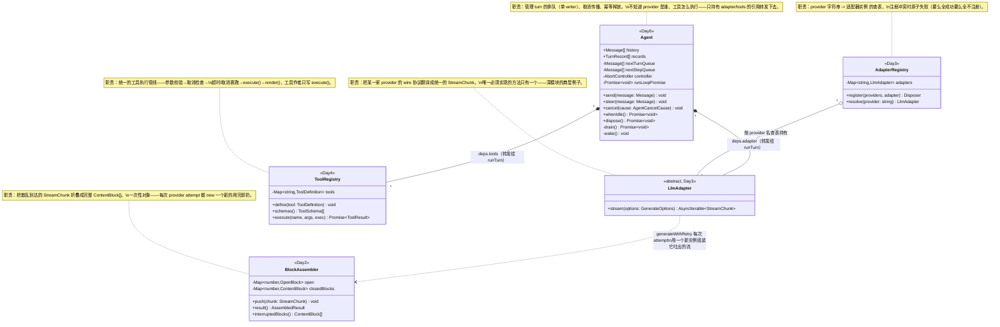

# Day 0・阶段一全貌地图（Day1-7 一张图看完）

> 这不是新的一天，不含新概念、不用做练习。它的作用是"地图"：每天读代码读到细节里出不来的时候，回来看一眼这份文档，找到自己现在钻的这行代码属于哪一环、这一环是哪天引入的、为什么需要它。

## 读法

不需要现在就看懂下面每一个词——这份文档故意放在 Day1 之前，你现在看不懂大部分术语是正常的。真正的用法是：**从 Day1 开始学，每学完一天回来这里对一遍**，看着地图上多亮起来一块。等 Day7 做完再完整看一遍，应该能不看代码，口头把这张图从头讲到尾。

## 一张图：一次用户请求，完整走一遍会经过哪些环节

```
用户在 CLI 敲下一个问题
  │
  ▼
Agent.send(message)                         ← Day6：排队进 inbox，不打断正在跑的 turn
  │
  ▼
Agent.drain() 内部循环，顺序处理队列          ← Day6：单 writer，任何时刻只有一个 turn 在跑
  │
  ▼
runTurn(history, deps, options)             ← Day5：turn/step 骨架，一个 async generator
  │
  ├─ yield 'turn-start'
  │
  ├─┬─ step 1 开始
  │ │
  │ │  generateWithRetry(adapter, options)   ← Day3：重试循环、退避策略、请求深冻结
  │ │    │
  │ │    │  adapter.stream(frozen)           ← Day3：LlmAdapter 抽象接口，屏蔽具体 provider SDK
  │ │    │    │
  │ │    │    ▼
  │ │    │  StreamChunk 逐个吐出              ← Day2：block-start/text-delta/tool-call-delta/block-end/usage/finish
  │ │    │    │
  │ │    │    ▼
  │ │    │  new BlockAssembler().push(chunk) ← Day2：把散乱分片折叠成完整 ContentBlock[]
  │ │    │    │
  │ │    ▼    ▼
  │ │  assembler.result() → { blocks, finish } → classifyFinish() 纠正畸形 finish
  │ │
  │ │  yield 'model-response'
  │ │
  │ │  ┌─ finish.kind === 'error'/'aborted' → turn-end，结束
  │ │  │
  │ │  └─ 有 tool-call 块？
  │ │        │
  │ │        ▼
  │ │      executeToolCall() → ToolRegistry.execute()   ← Day4：参数校验→取消检查→超时/取消赛跑→execute→render
  │ │        │                    │
  │ │        │                    ▼
  │ │        │                  read_file / list_files / search_text   ← Day4：三个只读深工具
  │ │        │
  │ │        ▼
  │ │      工具结果打包成 tool 消息，history.push()
  │ │
  │ │  yield 'step-end'
  │ └─ 没有欠工作了？→ 回到 step 开始，继续下一 step；欠工作清零 → 完成
  │
  ▼
return StopReason（completed / cancelled / budget_exhausted / error）  ← Day5：generator 的 return 值，不是 yield
  │
  ▼
Agent.records.push(TurnRecord)              ← Day6：这一条 turn 的最终记录
  │
  ▼
CLI 把结果打印出来                            ← Day7：把以上全部拼成一个能跑的命令行程序
```

## 每天在这张图里加了什么、为什么

| 天 | 主题 | 在图里对应哪一环 | 解决的核心问题 |
|---|---|---|---|
| [Day1](../day01-agent-vs-workflow/) | Agent / Workflow / Harness 边界 | 图外——决定"这件事到底该不该用这整套东西" | 先证明"这个任务真的需要 Agent loop"，不是默认所有任务都要上 |
| [Day2](../day02-llm-message-and-streaming/) | 消息模型与流式协议 | `StreamChunk` → `BlockAssembler` | provider 返回的是网络分片，怎么折叠回一条完整消息、怎么防畸形流 |
| [Day3](../day03-adapter-boundary/) | Adapter 边界与请求信封 | `LlmAdapter` → `generateWithRetry` | Agent loop 不认识任何具体 provider SDK；失败怎么分类、怎么重试 |
| [Day4](../day04-tool-design/) | 工具设计 | `ToolRegistry.execute()` → 三个只读工具 | 模型要的是"意图层面"的简单接口，复杂度（校验/超时/取消）下沉到管线里 |
| [Day5](../day05-agent-loop/) | Agent Loop | `runTurn()` 整个骨架 | turn/step 什么时候该继续、什么时候该停，"数据说了算"不是"模型嘴上说了算" |
| [Day6](../day06-lifecycle-and-cancellation/) | 生命周期、取消与并发 | `Agent.send/cancel/dispose/whenIdle` | 外部怎么安全地控制这个循环——排队、取消、释放,不产生竞态 |
| [Day7](../day07-milestone-cli/) | 里程碑一：CLI | 把以上全部拼装起来 | 验证六天搭的骨架能不能撑起一个真实可跑的东西，在各种坏路径下行为可预期 |

## 类型怎么一层层复合起来（不是调用顺序，是"谁的字段装着谁"）

上面那张图讲的是"谁调用谁"；这张图讲另一件事——**每天新定义的类型，最终是怎么被塞进后面某一天定义的另一个类型里的某个字段的**。自底向上一天天学，容易只看到"这一层又冒出几个新类型"，看不到它们其实一路复合成了一整棵树。四条主线,分别追一遍：

**主线一：一条消息的内容，怎么从"一堆碎片"变成"历史记录里的一条"**

```
ContentBlock（Day2，联合类型：TextBlock/ReasoningBlock/ToolCallBlock/ToolResultBlock）
  └─ Message.blocks: ContentBlock[]                        （Day2：一条消息 = 一个内容块数组）
       ├─ GenerateOptions.messages: Message[]               （Day3：请求里塞的历史快照）
       └─ GenerateResult.message: Message                   （Day3：这次调用组装出的新消息）
            └─ TurnRecord.userMessage: Message              （Day6：记录这条 turn 在回应哪条用户消息）
       └─ Agent.history: Message[]                          （Day6：整个对话历史，一路 push 进去的就是这些 Message）
```

**带例子走一遍**（用户问"帮我查一下 auth 模块"，模型回了一句话）：

```jsonc
// 1. ContentBlock（Day2）—— 最小的一块内容
{ "type": "text", "text": "帮我查一下 auth 模块" }

// 2. 包进 Message.blocks（Day2）—— 一条消息 = 角色 + 内容块数组
{ "role": "user", "blocks": [ { "type": "text", "text": "帮我查一下 auth 模块" } ] }

// 3. 这条 Message 进了 GenerateOptions.messages（Day3）—— 请求里带着的历史快照
{ "provider": "fake", "model": "x", "messages": [ /* 上面这条 Message，以及更早的历史 */ ] }

// 4. adapter 组装出一条新的 Message，成为 GenerateResult.message（Day3）
{ "role": "assistant", "blocks": [ { "type": "text", "text": "好的，我先看看 auth 目录" } ] }

// 5. 这条新 Message 原样存进 TurnRecord.userMessage 对应的那次 turn 记录（Day6）
{ "userMessage": { "role": "user", "blocks": [ /* 第2步那条 */ ] }, "stopReason": { "kind": "completed" } }

// 6. 两条 Message 都躺在 Agent.history 里（Day6）
[
  { "role": "user", "blocks": [ { "type": "text", "text": "帮我查一下 auth 模块" } ] },
  { "role": "assistant", "blocks": [ { "type": "text", "text": "好的，我先看看 auth 目录" } ] }
]
```

**主线二：一次工具调用，怎么从"消息里的一个块"变成"历史里的另一条消息"**

```
ToolCallBlock（Day2 定义，ContentBlock 的一种）
  └─ 从 GenerateResult.message.blocks 里过滤出来      （Day5：runTurn 里的 toolCalls 数组）
       └─ 传给 ToolRegistry.execute(call.name, args, ctx)   （Day4）
            └─ 返回 ToolResult { content, value, ... }       （Day4：工具执行的规范结果）
                 └─ 包装成 ToolResultBlock { toolCallId: call.id, content, isError }  （Day2 类型，Day5 组装）
                      └─ 塞进新的 Message { role: 'tool', blocks: [...] }             （Day2 类型，Day5 用法）
                           └─ history.push(...) 回到 Agent.history                    （Day6）
```

**带例子走一遍**（模型决定调用 `list_files` 查看 `src/auth` 目录）：

```jsonc
// 1. ToolCallBlock（Day2）—— 模型响应里的一个内容块，注意 arguments 是字符串
{ "type": "tool-call", "id": "c1", "name": "list_files", "arguments": "{\"path\":\"src/auth\"}" }

// 2. Day5 runTurn 从 message.blocks 里过滤出这类块，得到 toolCalls 数组
[ /* 上面这个 ToolCallBlock */ ]

// 3. 参数被 JSON.parse 之后，传给 ToolRegistry.execute('list_files', {path:'src/auth'}, ctx)（Day4）
//    工具执行完，返回一个 ToolResult：
{ "name": "list_files", "args": { "path": "src/auth" }, "value": { "entries": ["index.ts", "middleware.ts"] }, "content": "src/auth:\nindex.ts\nmiddleware.ts" }

// 4. 包装成 ToolResultBlock（Day2 类型，Day5 组装）—— 用 toolCallId 指回第1步的 id
{ "type": "tool-result", "toolCallId": "c1", "content": "src/auth:\nindex.ts\nmiddleware.ts", "isError": false }

// 5. 塞进一条新的 role: 'tool' 消息（Day2 类型，Day5 用法）
{ "role": "tool", "blocks": [ /* 上面这个 ToolResultBlock */ ] }

// 6. history.push(...)，Agent.history 里紧跟在那条带 tool-call 的 assistant 消息后面（Day6）
```

**主线三：一次调用"怎么结束的"，怎么从 provider 的原始信号变成给用户看的最终状态**

```
FinishReason（Day2 定义：stop / tool-calls / max-tokens / aborted / error）
  └─ GenerateResult.finish: FinishReason               （Day3：一次 provider attempt 的结束原因）
       └─ runTurn 用它 + toolCalls.length 一起判断这一步该不该继续  （Day5，见 day05 study.md §2 的真值表）
            └─ StopReason（Day5 自己定义的新类型：completed/cancelled/budget_exhausted/error——
                          注意这不是 FinishReason 改名，是另一个类型，只在 error 分支复用了同一个 LlmFailure）
                 └─ TurnRecord.stopReason: StopReason   （Day6：这条 turn 最终定格成哪一种终态）
```

**带例子走一遍**（正常完成的例子，加一个错误例子看 `LlmFailure` 怎么被原样复用）：

```jsonc
// 正常完成路径：
// 1. 第一个 step，provider 说要调用工具（FinishReason，Day2/Day3）
{ "kind": "tool-calls" }
// runTurn 结合 toolCalls.length > 0，判定"还没完成"，继续跑下一 step（不产生 StopReason）

// 2. 第二个 step，provider 说没别的事了（FinishReason）
{ "kind": "stop" }
// 这次 toolCalls.length === 0，runTurn 判定完成，产出 StopReason（Day5 定义，不是同一个类型）
{ "kind": "completed" }

// 3. 存进 TurnRecord.stopReason（Day6）
{ "stopReason": { "kind": "completed" } }

// 错误路径：LlmFailure 被原样复用，不是重新拼一份
// GenerateResult.finish（Day3）：
{ "kind": "error", "failure": { "code": "TIMEOUT", "message": "provider 响应超时" } }
// runTurn 直接把同一个 failure 对象塞进 StopReason（agent-loop.ts:119，没有重新构造 LlmFailure）：
{ "kind": "error", "failure": { "code": "TIMEOUT", "message": "provider 响应超时" } }
```

**主线四：这一路上发生的事件和取消原因，怎么被记下来**

```
AgentLoopEvent（Day5 定义：turn-start/step-start/model-response/tool-call/tool-result/step-end/turn-end）
  └─ TurnRecord.events: AgentLoopEvent[]                （Day6：drain() 把 runTurn 产出的每个事件收集起来）

AgentCancelCause（Day6 定义：user/parent/hook/disposed）
  └─ TurnRecord.cancelCause?: AgentCancelCause          （Day6：这条 turn 如果是被取消的，原因记在这）
```

**带例子走一遍**（一次正常完成的 turn，和一次因为 dispose 被取消的 turn，对比着看）：

```jsonc
// 正常完成的 turn，events 里没有取消相关的内容，TurnRecord 也没有 cancelCause 字段：
{
  "userMessage": { "role": "user", "blocks": [ /* ... */ ] },
  "events": [
    { "type": "turn-start" },
    { "type": "step-start", "step": 1 },
    { "type": "model-response", "message": { /* ... */ }, "finish": { "kind": "stop" } },
    { "type": "step-end", "step": 1 },
    { "type": "turn-end", "stopReason": { "kind": "completed" } }
  ],
  "stopReason": { "kind": "completed" }
  // 没有 cancelCause —— 这个字段是可选的（AgentCancelCause?），不是被取消的 turn 就不会有它
}

// 被 dispose() 取消的 turn：
{
  "userMessage": { "role": "user", "blocks": [ /* ... */ ] },
  "events": [
    { "type": "turn-start" },
    { "type": "step-start", "step": 1 },
    { "type": "turn-end", "stopReason": { "kind": "cancelled" } }
  ],
  "stopReason": { "kind": "cancelled" },
  "cancelCause": { "kind": "disposed" }   // dispose() 内部调 cancel({kind:'disposed'}) 时记下的原因
}
```

**怎么用这张图**：以后遇到一个陌生类型（比如 `ToolResultBlock`），先别慌，问自己两个问题——"这个类型是哪天定义的？"（决定去哪个 study.md 找它的设计意图），"它最终被装进了哪个更高层类型的哪个字段？"（决定它在整条链路里扮演什么角色）。四条主线基本覆盖了 Day1-7 所有跨天复用的类型；一个类型如果不在这四条线上，大概率是某一天内部的实现细节，不需要跨天追。

## 类图：这几天定义的类，各自负责什么

前两张图讲"谁调用谁"和"类型怎么嵌套"；这张图换个角度——**Day1-7 里真正称得上"类"（有内部状态、有方法，不只是数据形状）的其实只有四个**，其余全是没有行为的纯数据类型（interface/联合类型）。先看清楚这四个类各自的职责边界,再回头看之前两张图会更有体感。



**几个容易忽略但重要的边界**：

- **`runTurn()` 本身不是类，是一个独立的 async generator 函数**（Day5）——它不持有任何跨调用的状态,每次调用都是全新的一次执行,状态全部通过参数（`history`）和局部变量（`step`/`toolCallCount`）传递。这也是为什么图里没有一个叫 `RunTurn` 的类：它是纯粹的"过程"，不是"对象"。`Agent.drain()` 每处理一条排队消息就调用它一次。
- **`Agent` 不认识 `BlockAssembler`**，两者中间隔着 `LlmAdapter`/`generateWithRetry` 这一层——`Agent` 只知道"我有一个 `adapter`，它能 `stream()`"，组装流水线的细节完全被 `LlmAdapter` 这个抽象挡住了，这正是 Day3 study.md 第1节"Agent loop 不该认识任何具体 SDK 类型"的字面体现，`BlockAssembler` 同样不该被 `Agent` 认识。
- **`ToolRegistry` 和 `AdapterRegistry` 长得像双胞胎**（都是"字符串 → 具体实现"的查表），但服务对象不同：一个查的是"这次调用该用哪个工具"，一个查的是"这次请求该用哪个 provider"——这不是巧合，是同一种设计模式（把"选哪个具体实现"的判断，从调用方那里收进一个专门的注册表）在两个不同场景里的复用。
- **四个类里，只有 `Agent` 有跨调用保留的可变状态**（`history`/`records`/`nextTurnQueue` 这些字段会在多次方法调用之间累积）。`BlockAssembler` 是一次性用品，`AdapterRegistry`/`ToolRegistry` 注册之后基本是只读查表——**状态越多的类，需要操心的并发/生命周期问题就越多**，这也是为什么 Day6（专门讲生命周期、取消、并发）刚好是 `Agent` 这个"全场唯一有状态的类"登场的那一天，不是时间安排上的巧合。

## 贯穿全程的几条设计主线（不属于任何单独一天，是反复出现的思想）

这几条不是某一天的知识点，是从 Day2 到 Day6 反复出现、每次以不同形式印证的同一批原则——读代码时如果感觉"这个设计怎么又出现了"，大概率就是撞上了下面某一条：

- **深模块，浅接口**：模型/调用方看到的接口越来越简单（工具只传 `file_path`/`offset`/`limit`），复杂度（校验、超时、重试、取消）全部被吸进对应模块内部，不转嫁给调用方。Day4 讲得最集中，但 Day3 的 `generateWithRetry`、Day6 的 `Agent` 类都是同一条原则的不同落地。
- **数据说了算，不是模型嘴上说了算**：Day5 的"只信 blocks 数据不信 finish.kind 自报"、Day2 的"组装器只认已封箱的块"，本质是同一条：系统的终态判断必须建立在可观察的状态上，不能建立在一个不可靠信号（模型的自我报告）上。
- **用设计定义掉特殊情况**：Day4 的 `additionalProperties` 必须在定义期显式声明、Day2 的畸形流直接被组装器拒绝——遇到"这种情况按理说不该发生"的场景，优先考虑能不能让接口设计本身就不允许它发生，而不是到处写 if 兜底。
- **取消不是布尔值**：Day6 专门讲，但 Day4 的 `ToolAbortedError`、Day3 的 `ABORTED` 永不重试都是这条原则更早的伏笔——"取消了没有"不够，"谁取消的、为什么"同样要被记录。
- **异常冒泡到"知道该怎么处理"的那一层，不是抛出的那一层自己兜底**：Day4 的 `ToolRegistry.execute()` 故意不 catch 自己抛出的错误，交给 Day5 的 `executeToolCall()` 决定转成 `isError` 结果——这是职责分层，不是遗漏。
- **每一层都在真实踩坑中暴露、而不是设计时凭空想到**：`freezeRequest` 冻死可变历史数组（Day3+Day5 组合出的坑）、深冻结连 `AbortSignal` 都冻住了（Day3 埋雷、Day6 暴露）——这些坑都是"两个独立正确的设计拼在一起才炸"，也是为什么"设计两次"和端到端集成测试比孤立的单元覆盖率更重要。

## 一句话记忆法（如果只能记一句）

**"一次用户输入，被 `Agent` 排进队列，`runTurn` 用 turn/step 的节奏反复问模型、执行工具、更新历史，直到数据显示不再欠任何工作；这中间每一层——消息怎么拼、模型怎么调、工具怎么跑、怎么被取消——都遵循同一条原则：接口给外面的越简单，内部主动扛的复杂度就越多。"**
