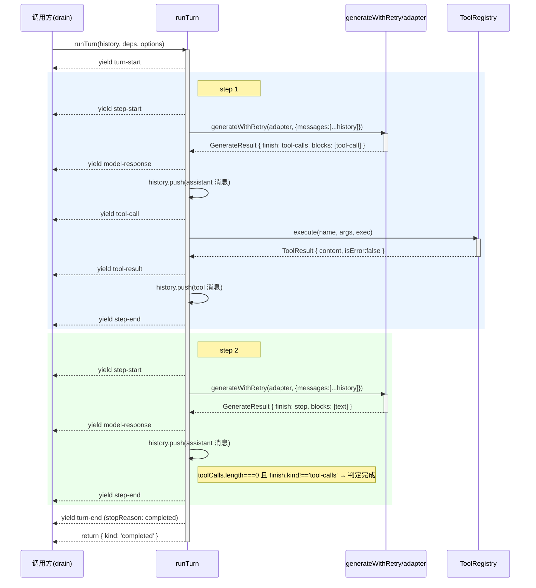

任务 1：读代码 + 画时序图

读完 `agent-loop.ts` 后，为"模型第一次请求返回一个工具调用，工具执行成功，模型第二次请求返回文本并完成"这个场景画一张时序图（手绘拍照或者用 mermaid 都行），角色至少包括：调用方、`runTurn`、`generateWithRetry`/adapter、`ToolRegistry`。标出 turn/step 的边界在哪。

```mermaid
sequenceDiagram
    participant Caller as 调用方(drain)
    participant RT as runTurn
    participant GWR as generateWithRetry/adapter
    participant TR as ToolRegistry

    Caller->>RT: runTurn(history, deps, options)
    activate RT
    RT-->>Caller: yield turn-start

    rect rgb(235, 245, 255)
    note right of RT: step 1
    RT-->>Caller: yield step-start
    RT->>GWR: generateWithRetry(adapter, {messages:[...history]})
    activate GWR
    GWR-->>RT: GenerateResult { finish: tool-calls, blocks: [tool-call] }
    deactivate GWR
    RT-->>Caller: yield model-response
    RT->>RT: history.push(assistant 消息)

    RT-->>Caller: yield tool-call
    RT->>TR: execute(name, args, exec)
    activate TR
    TR-->>RT: ToolResult { content, isError:false }
    deactivate TR
    RT-->>Caller: yield tool-result
    RT->>RT: history.push(tool 消息)
    RT-->>Caller: yield step-end
    end

    rect rgb(235, 255, 235)
    note right of RT: step 2
    RT-->>Caller: yield step-start
    RT->>GWR: generateWithRetry(adapter, {messages:[...history]})
    activate GWR
    GWR-->>RT: GenerateResult { finish: stop, blocks: [text] }
    deactivate GWR
    RT-->>Caller: yield model-response
    RT->>RT: history.push(assistant 消息)
    note right of RT: toolCalls.length===0 且 finish.kind!=='tool-calls' → 判定完成
    RT-->>Caller: yield step-end
    end

    RT-->>Caller: yield turn-end (stopReason: completed)
    RT-->>Caller: return { kind: 'completed' }
    deactivate RT
```