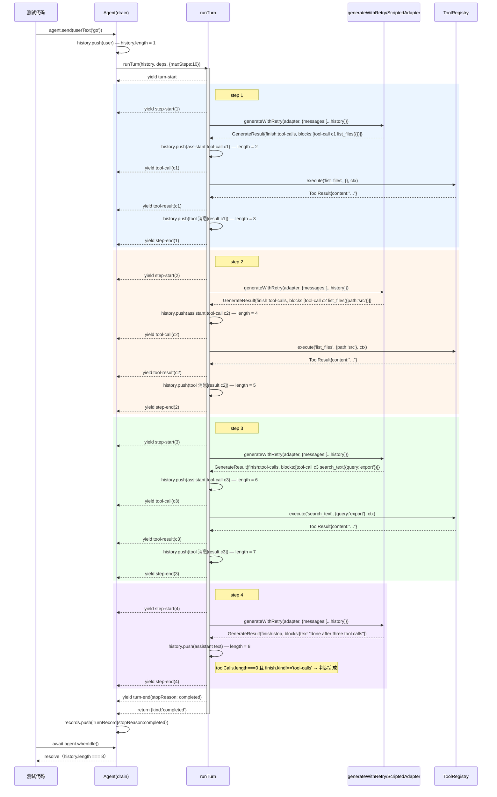

# 场景19 时序图："多步 tool call 后完成"

对应 `mini-harness/tests/scenarios.test.ts` 第19条：`19. a multi-step growing history does not trip the Day5 request-freeze bug`。

脚本（`ScriptedAdapter` 按顺序重放的4条消息）：

1. `list_files({})` → `finish: tool-calls`
2. `list_files({path:'src'})` → `finish: tool-calls`
3. `search_text({query:'export'})` → `finish: tool-calls`
4. 纯文本 `"done after three tool calls"` → `finish: stop`

`history` 最终长度断言是 8 = 1条 user + 3组(assistant tool-call + tool result) + 1条最终 assistant。

## 对照任务要求逐条回答

- **每个 step 的边界**：图里用4个背景色块（`rect`）分别框出 step 1-4，每个 step 都是"`step-start` → 请求模型 → （有工具调用则执行工具）→ `step-end`"一个完整周期。
- **`history` 数组在每一步之后增加了哪些元素**：见上面每条 `history.push` 注释旁的长度标注——1（user）→ 2（+assistant tool-call）→ 3（+tool result）→ 4 → 5 → 6 → 7 → 8（+最终 assistant text），每个 step 恰好增加 1 或 2 条，最终长度 8 与测试断言一致。
- **哪个环节调用了 `generateWithRetry`（Day3）**：每个 step 开头，`runTurn` 向 `GWR`（`generateWithRetry`/`ScriptedAdapter`）发起请求的那一步——图中每个 rect 块里的 `RT->>GWR: generateWithRetry(...)` 那一行，一共调用4次（对应4个 step）。
- **哪个环节调用了 `ToolRegistry.execute()`（Day4）**：只有解析出工具调用的 step（1-3）才会调用，`RT->>TR: execute(...)` 那一行；step 4 因为是纯文本响应，没有这一步。
