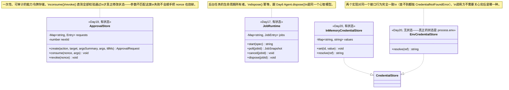

# 阶段三全貌地图（Day15-21，仿照 Day00/Day08-13 的写法）

> 跟 [Day00](../day00-phase1-overview/)、[Day08-13](../day08-13-phase2-overview/) 一样：不含新概念、不用做练习，是学完 Day15-21 之后回来对照用的地图。Day00 讲"循环怎么跑"，Day08-13 讲"状态怎么存、怎么保证能重建"，这份讲"一旦 Agent 有了真正的副作用能力（写文件、跑命令），怎么在给它这些能力的同时不失控"。

## 读法

跟前两份一样：从 Day15 学到 Day21，每学完一天回来对一遍这份文档，看着地图上多亮起来一块。`modules/day21-milestone-secure-agent/` 下已经有 [security-test-index.md](../day21-milestone-secure-agent/security-test-index.md)（25条安全回归测试的跨天索引）和 [incident-drill.md](../day21-milestone-secure-agent/incident-drill.md)（事故演练）——这两份不在这里重复，这里只补阶段三缺的那一块：类型复合图。

## 一张图：一次 `propose-edit` 调用，从命令行到磁盘再到验证命令

```
用户敲下 pnpm cli -- propose-edit --workspace <dir> --file <path> --find <text> --replace <text>
  │
  ▼
cli.ts: runProposeEditCommand(argv)                          ← Day21
  │
  ▼
propose-edit.ts: proposeEdit(options)
  │
  ├─ readFile(target) + ensureNotBinaryOrThrow()              ← Day15 file-io.ts
  │
  ├─ generateEditProposal(previousContent, find, replace)     ← Day21：确定性查找替换，
  │    │                                                         不接真实模型（跟 Day7
  │    │                                                         HeuristicInvestigationAdapter
  │    │                                                         同一个"用写死规则代替模型"套路）
  │    ▼
  │  EditProposal { previousHash, newContent, diff }           diff 来自 Day15 simpleDiff()
  │
  ├─ diff === '(no changes)' ? → 直接返回 no-changes，不生成审批请求
  │
  ├─ approvalStore.create(action, target, argsSummary, args, ttl)   ← Day19 ApprovalStore
  │    │
  │    ▼
  │  ApprovalRequest { nonce, argsHash, expiresAt, ... }
  │
  ├─ preset?.decide('edit_file')                              ← Day19 PermissionPreset
  │    │
  │    ├─ 'auto-approve' → 跳过人工确认
  │    ├─ 'deny'         → 直接拒绝，requestApproval() 从不被调用
  │    └─ 'require-approval' → 调用 requestApproval(request, diff)（Day21 CLI 默认实现：
  │                              真的读 stdin；测试里注入固定返回值）
  │
  ├─ 批准 → approvalStore.consume(request.nonce, args)         ← Day19，烧掉 nonce
  │
  ├─ ToolRegistry.execute('edit_file', args, exec)             ← Day15 edit_file（Day4 ToolRegistry）
  │    │
  │    ▼
  │  EditFileValue { newHash, ... }
  │
  └─ verify? → ToolRegistry.execute('run_command', {...}, exec) ← Day16 run_command
       │         （createRunCommandTool 可选接 Day18 CommandPolicy，
       │          可选接 Day20 WorkspaceContext.envCredentials 注入凭据）
       ▼
     RunCommandValue.exitCode ← 直接抄自 Day16 ProcessRunResult.exitCode
       │
       ▼
     VerificationResult { exitCode, passed, output }            ← Day21
       │
       ▼
     ProposeEditOutcome { kind: 'applied', diff, newHash, verification }
```

## 每天在这张图里加了什么、为什么

| 天 | 主题 | 在图里对应哪一环 | 解决的核心问题 |
|---|---|---|---|
| [Day15](../day15-filesystem-consistency/) | 文件系统能力与一致性 | `edit_file`、`resolveWithinRoot`、`expectedHash`/`simpleDiff` | 给 Agent 第一个有副作用的能力，必须挡住 symlink 逃逸和"读写之间被人改了"这两类问题 |
| [Day16](../day16-subprocess-and-bash/) | 子进程与 Bash 执行 | `run_command`、`SpawnSpec`、`ProcessRunResult` | 子进程是"一旦启动就不再完全受你控制"的东西——argv 不过 shell、有界输出、杀整棵进程树 |
| [Day17](../day17-jobs-and-resource-ownership/) | PTY、后台任务与资源所有权 | `JobRuntime`（`start_job`/`job_status`/`cancel_job`，图里没画,因为 `propose-edit` 没用到）| 长时间任务要能"发起后立刻返回"，但生命周期（谁负责杀、谁负责释放）不能失控 |
| [Day18](../day18-sandbox-and-least-privilege/) | 沙箱与最小权限 | `CommandPolicy`（图里 `run_command` 可选接的那一层）| 策略判断和执行分离，策略本身出错要 fail-closed，不能悄悄放行 |
| [Day19](../day19-approval-and-permissions/) | 审批、权限预设与用户问答 | `ApprovalStore`/`ApprovalRequest`/`PermissionPreset`（图里 `create`/`decide`/`consume` 那几步）| 审批必须是一次性、绑定具体参数的能力令牌，不是聊天记录里一句"可以" |
| [Day20](../day20-credentials-settings-workspace/) | 凭据、设置、存储与工作区 | `CredentialRef`/`CredentialStore`/`WorkspaceContext`（图里 `run_command` 可选接的凭据注入）| 密钥在系统里只能以不透明引用流动，真实值只在使用点解析 |
| [Day21](../day21-milestone-secure-agent/) | 里程碑三：安全执行型 Agent | 整张图——`proposeEdit()` 本身 | 前六天独立验证过的机制，第一次真正串成一条能从 CLI 跑起来的链路 |

## 类型怎么一层层复合起来

**主线一：`WorkspaceContext`（Day20）把"工作区"从一个裸路径升级成身份/能力边界**

```
CredentialRef（Day20，src/core/credentials.ts:7-9）
  { readonly id: string }
  └─ WorkspaceContext.envCredentials?（Day20，workspace-context.ts:17）
       Readonly<Record<string, CredentialRef>>

CredentialStore（Day20，credentials.ts:18-21，接口）
  ├─ InMemoryCredentialStore implements CredentialStore（Day20）
  └─ EnvCredentialStore implements CredentialStore（Day20 exercise 任务2，读 process.env）
  └─ WorkspaceContext.credentials（Day20，workspace-context.ts:11）
       CredentialStore
```

`CredentialRef` 只是个 `{id: string}`，本身不含真实值；`WorkspaceContext` 把"这次调用该带哪些凭据"（`envCredentials`，一份 `key → CredentialRef` 的映射）和"上哪查真实值"（`credentials`，一个 `CredentialStore` 实现）分别装进两个字段——`run_command`（`bash-tool.ts`）在真正 spawn 前才调用 `credentials.resolve(ref)` 把 `CredentialRef` 换成真实字符串,这一步既是唯一一处真实值出现的地方，也是这条主线最终"落地"的位置。

**主线二：`ApprovalRequest`（Day19）被 `UserInteractionRequest`（Day19）当成三选一里的一支收进来**

```
ApprovalRequest（Day19，approval.ts:10-16）
  { nonce, action, target, argsSummary, argsHash, expiresAt }
  └─ UserInteractionRequest['approval'] 分支（Day19，approval.ts:128-131）
       { kind: 'approval'; request: ApprovalRequest }
  └─ ProposeEditOutcome['denied'] 分支（Day21，propose-edit.ts:70-78）
       { kind: 'denied'; diff: string; request: ApprovalRequest }
```

`ApprovalRequest` 定义之初就是给"审批"这一种交互用的；`UserInteractionRequest` 把它跟 `question`/`choice` 放进同一个封闭联合类型（`assertNeverInteraction` 兜底），三者共享"这是一次需要用户输入的交互"这个上位概念，但回答方式完全不同（自由文本/选项/批准-拒绝）。Day21 的 `ProposeEditOutcome` 没有直接复用整个 `UserInteractionRequest`——因为 `propose-edit` 这条链路从设计上就只处理审批这一种交互，不需要 `question`/`choice` 两支——但仍然原样嵌入了 `ApprovalRequest` 这个叶子类型，而不是重新定义一份"审批被拒绝时要带什么信息"。

**主线三：`VerificationResult`（Day21）的 `exitCode` 一路从 `ProcessRunResult`（Day16）抄过来，中间转手了两次**

```
ProcessRunResult.exitCode（Day16，process-runner.ts:32-33）
  number | null
  └─ 赋给 RunCommandValue.exitCode（Day16，bash-tool.ts:29,154：exitCode: result.exitCode）
       └─ 读成 verifyValue.exitCode（Day21，propose-edit.ts:148，从 ToolResult.value 取出）
            └─ 赋给 VerificationResult.exitCode（Day21，propose-edit.ts:45-46）
```

**为什么值得专门画出这条血统**：这四层没有一层是"重新定义了一个新的 exitCode 概念"——`run_command` 这个工具的返回值形状（`RunCommandValue`）本身就是 `ProcessRunResult` 的一个直接投影（`bash-tool.ts:152-162` 把 `runProcess()` 的结果原样摊平进工具返回值），`propose-edit.ts` 再把这个工具返回值（一个 `unknown` 类型的 `ToolResult.value`，只能靠调用方自己断言形状）读出 `exitCode` 字段来判断验证是否通过（`exitCode === 0`）。中间那次"`unknown` 断言成 `{exitCode: number|null}`"是这条链路里唯一一处丢失了静态类型保证的地方——`ToolRegistry.execute()` 的返回值类型设计成 `unknown`（Day4），是因为注册表不知道也不该知道每个工具具体返回什么形状；调用方（这里是 `propose-edit.ts`）要为这次"我确实知道 `run_command` 返回什么"的假设负责，这也是为什么真正跑起来的 `tests/propose-edit.test.ts` 里必须有一条"验证命令的 exitCode 真的决定了 `passed`"的端到端测试,不能只靠类型系统兜底。

## 阶段三新增的"真正的类"，对照 Day00/Day08-13 的类图风格



**`command-policy.ts`/`permission-presets.ts`/`settings.ts`/`file-io.ts`——绝大多数还是纯函数或无状态策略对象**：`AllowlistCommandPolicy`/`FailClosedCommandPolicy`（Day18）、`createReadonlyPreset`/`createBalancedPreset`/`createAutonomousPreset`（Day19）构造出来之后就不再变化,判断逻辑是纯函数；`mergeSettings()`（Day20）、`simpleDiff()`/`contentHash()`（Day15）从头到尾都是纯函数。这跟 Day08-13 阶段二的结论一致："给一份不可变的输入，算出点什么"这类模块天然不需要跨调用保留状态——阶段三真正需要状态的,只有"必须记住谁批准了什么"（`ApprovalStore`）、"必须记住哪个后台任务还在跑"（`JobRuntime`）、"必须记住某个 id 对应的真实密钥"（`CredentialStore` 的实现）这三类，都是"状态本身就是这个模块存在的理由"，不是图省事加的。

## 贯穿阶段三的一条主线：三次"诚实记录的缺口"，而不是三次"组合起来才暴露的坑"

阶段二（Day08-13）的主线是"两个各自正确的设计拼在一起才会暴露问题"——三次真实踩到的集成 bug。阶段三没有重复这个模式（`CLAUDE.md` 要求的跨接缝集成测试确实挡住了这一类），阶段三反复出现的是另一种纪律：**明确承认某个能力没有做、做不到,而不是假装它已经被解决**。

| 天 | 缺口 | 怎么诚实记录的 |
|---|---|---|
| Day17 | `JobRuntime` 只在内存里，进程重启后没有可恢复的 Job，只有"已失联" | `study.md` 里给出如果要做真正可恢复 Job 需要什么（持久化 `SpawnSpec`+`pid`，重启后探活，即使活着也因为丢了原始 pipe 只能重新 attach 或直接杀掉），当作"设计两次里的备选但没做" |
| Day18 | `CommandPolicy` 只挡"哪个程序能跑"，挡不住"被允许的程序自己发起网络请求"（网络外传） | `threat-model.md` 明确标成"❌ 接受的缺口"，配一条测试证明缺口真实存在、一条测试证明部分缓解（不在白名单里的已知网络工具会被拒绝）确实生效 |
| Day21 | `ApprovalStore.consume()` 发生在 `edit_file` 真正执行之前，两者之间的竞态会导致"批准已消费但写入失败、且不能重试同一个 nonce" | `propose-edit.ts` 顶部文档注释直接点名，`tests/propose-edit.test.ts` 里有一条专门的回归测试，`answer.md` 里进一步论证了"换个顺序会不会更好"这个问题本身也有新的权衡，不是单纯的"这样更安全" |

**为什么这个模式值得单独拎出来**：阶段三第一次让 Agent 拥有真正的副作用能力（写文件、跑命令、连网络），"完全消除风险"在这个项目的约束下（零原生依赖、不做真实 OS 沙箱）本来就不现实——诚实地画出"防线在哪里、防线之外是什么"，比假装用几个类型/几条校验就能兜住所有情况更接近真实的生产系统设计。这也是为什么阶段三的 `answer.md`/`study.md` 里反复出现"这个测试证明缺口真实存在"这种写法，不是通常意义上"证明系统是对的"的测试——**证明系统在哪里承认自己不是万能的，本身也是一种需要测试保证的属性**。
